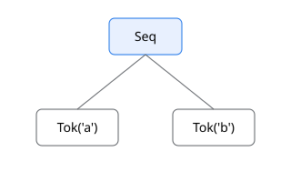
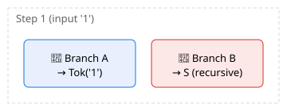
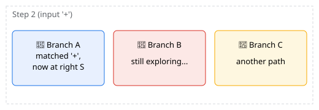
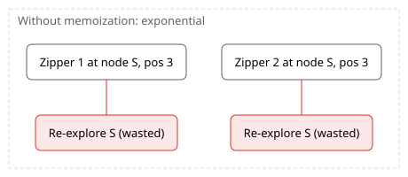
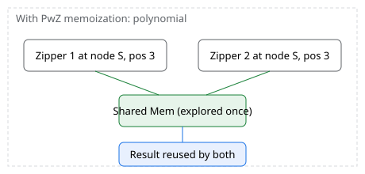
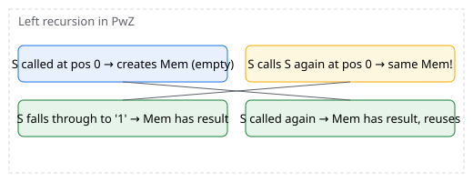
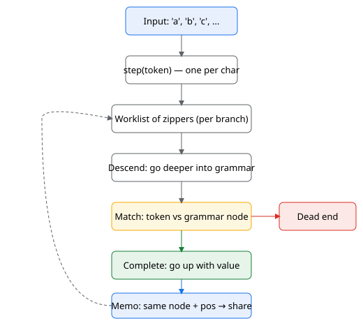

# @lapis-lang/zipper-grammar

A TypeScript implementation of **Parsing with Zippers** (Darragh & Adams,
ICFP 2020) with full semantic actions, an object-oriented front-end inspired
by Bracha's *executable grammars*.

Grammars are written as **classes**; productions are methods. Recursion —
including left-recursion and ambiguity — is handled by lazy references and
the PwZ zipper engine.

```ts
import { Grammar, rule } from '@lapis-lang/zipper-grammar';

class BalancedParens extends Grammar<{ s: string }> {
    start() { return this.s; }
    @rule get s() {
        return this.or(
            this.seq(this.char('('), this.s, this.char(')'), this.s).map(() => 'ok'),
            this.epsilon('ok'),
        );
    }
}

new BalancedParens().recognize('(()())'); // true
new BalancedParens().parse('()');         // Set { 'ok' }
```

## Installation

```bash
# Deno
deno add jsr:@lapis-lang/zipper-grammar

# npm / yarn / pnpm / bun
npx jsr add @lapis-lang/zipper-grammar
```

Then import from `jsr:@lapis-lang/zipper-grammar` (Deno) or `@lapis-lang/zipper-grammar` (Node-style resolvers via the JSR npm compatibility layer).

## Why "executable grammars"?

A grammar class **is** the parser. Productions are real methods, so they can
be **overridden** in subclasses to extend or wrap behaviour:

```ts
class Traced extends MathEval {
    readonly trace: number[] = [];
    @rule override get expr() {
        return super.expr.map((n) => { this.trace.push(n); return n; });
    }
}
```

Composition by inheritance, not by re-defining the grammar from scratch. See
[examples/arith.ts](examples/arith.ts).

## Shape-typed grammars

For grammars with multiple productions returning different parse-tree types,
parameterise the grammar by a **shape interface** mapping production names to
their parse-tree types:

```ts
interface MathShape { [k: string]: unknown; expr: unknown; term: unknown; factor: unknown }

abstract class AbstractMath<S extends MathShape> extends Grammar<S> {
    protected abstract add(l: S['expr'], r: S['term']): S['expr'];
    protected abstract num(s: string): S['factor'];
    @rule get expr(): Parser<S['expr']> { /* ... */ }
    @rule get term(): Parser<S['term']> { /* ... */ }
    @rule get factor(): Parser<S['factor']> { /* ... */ }
}

class MathEval extends AbstractMath<{ expr: number; term: number; factor: number }> {
    protected add(l: number, r: number) { return l + r; }
    /* ... */
}

class MathAST  extends AbstractMath<{ expr: Exp; term: Exp; factor: Exp }> {
    protected add(l: Exp, r: Exp): Exp { return { tag: 'add', left: l, right: r }; }
    /* ... */
}
```

The shape generalises the single-type `Grammar<T>` pattern (one global result
type) to per-production result types while keeping subclass overrides
type-safe.

## Context-sensitive (parameterised) grammars

When a production depends on runtime context — such as the current
indentation depth — declare it as a `@rule` **method** instead of a getter.
The decorator caches a separate `DelayedExp` slot per `(instance, method,
arguments)` tuple, so calling `this.block(2)` and `this.block(4)` creates
two independent, mutually-recursive parser nodes:

```ts
class IndentLang extends Grammar<{ doc: Node[] }> {
    override start() { return this.block(0); }

    @rule block(depth: number): Parser<Node[]> {
        return this.seq(this.line(depth), this.block(depth).opt())
            .map(([first, rest]) => [first, ...(rest ?? [])]);
    }

    @rule line(depth: number): Parser<Node> {
        // leaf:   <spaces> key ": " value "\n"
        const leaf = this.seq(this.spaces(depth), this.key, this.literal(': '), this.value, this.char('\n'))
            .map(([, k, , v]) => ({ kind: 'leaf' as const, key: k, value: v }));
        // branch: <spaces> key ":\n" <nested block>
        const branch = this.seq(this.spaces(depth), this.key, this.literal(':\n'), this.block(depth + 2))
            .map(([, k, , children]) => ({ kind: 'branch' as const, key: k, children }));
        return this.or(branch, leaf);
    }

    @rule spaces(n: number): Parser<string> {
        if (n === 0) return this.epsilon('');
        return this.seq(this.char(' '), this.spaces(n - 1)).map(() => '');
    }
}
```

See [examples/indent.ts](examples/indent.ts) for the full working example,
including `key` and `value` productions.

## Semantics as grammars

Inference rules and grammar productions are two sides of the same coin.
A typing judgment `Γ ⊢ e : τ` can be encoded as a parameterised production
`expr(Γ): Parser<Type>`; an evaluation judgment `ρ ⊢ e ⇓ v` as
`expr(ρ): Parser<Value>`.  The grammar is no longer merely recognising
syntax — it is *deriving judgments*.

This connection is well-known in the attribute-grammar tradition:

| Attribute grammar concept       | This library                              |
| ------------------------------- | ----------------------------------------- |
| Inherited attributes (top-down) | `@rule expr(Γ)` method arguments          |
| Synthesized attributes (bottom-up) | `.map((val, span) => ...)`             |
| Two-phase evaluation            | `super.expr.map(evalFn)` (multi-pass)     |
| L-attributed one-pass            | `chain(first, fn)` — monadic bind          |

### Two patterns for semantics

**Pattern 1 — multi-pass via `super`**: a subclass calls
`super.expr.map(evalFn)` where `evalFn` is a separate recursive function over
the AST.  Open recursion (OOP subclassing) gives pass composition for free —
the class hierarchy *is* the compiler pipeline.  Use when the context depends
on a *synthesized* attribute (e.g. `let x = def in body` needs `def`'s value
before evaluating `body`).

**Pattern 2 — one-pass judgments-as-productions**: restructure productions
with a context parameter `@rule expr(Γ): Parser<Type>`.  Use when context
extensions are *syntactic* — e.g. `λx:τ.body` extends `Γ` with `x:τ` where `τ`
is an annotation parsed *before* the body.

### The `chain` combinator (monadic bind)

The key enabler for Pattern 2 is `chain` — monadic bind for parsers.  It
parses the first parser, then — *after* it completes — calls a function with
the result to construct the second parser.  This lets a left sibling's
*synthesized* value determine the right sibling's *inherited* context,
which is exactly the **L-attributed grammar** pattern:

```ts
@rule
protected lambdaProd(ctx: unknown): Parser<S['expr']> {
    return this.seq(
        this.lambdaHead, this.ident, this.ws, this.char(':'), this.ws,
        this.type, this.ws, this.char('.'), this.ws,
    ).chain(([, param, , , , ty, , , ]) =>
        // τ is now available; extend ctx and parse body.
        this.exprProd(this.extendCtx(ctx, param, ty))
            .map((body) => this.lam(param, ty, body))
    ).map(([, result]) => result);
}
```

Without `chain`, `seq` builds all children eagerly at construction time, so
the parsed `τ` cannot flow into `body`'s parser.  `chain` defers construction
of the second parser until the first has completed — exactly when the zipper
reaches that point in the left-to-right traversal.

### Examples

| Example | Pattern | Demonstrates |
| ------- | ------- | ------------- |
| `arith-var.ts` | Pattern 2 (read-only env) | Inherited attributes, variable lookup |
| `stlc.ts` | Both | One-pass type checking (Pattern 2), multi-pass evaluation (Pattern 1), proof-bearing type checking |
| `proplogic.ts` | Both | Truth evaluation (Pattern 2), natural-deduction proofs (Pattern 1) |
| `lambda-eval.ts` | Pattern 1 | Untyped evaluation via multi-pass |

See [examples/stlc.ts](examples/stlc.ts) for the headline example: Simply
Typed Lambda Calculus with four interpretations (AST, type checker,
evaluator, proof-bearing type checker) over one abstract grammar.

## Source positions

Every `.map()` callback receives a `Span` as its second argument describing
the half-open character-offset range `[start, end)` of the matched input:

```ts
import type { Span } from '@lapis-lang/zipper-grammar';

interface Node { text: string; span: Span }

const word = grammar.word.map(
    (text, span): Node => ({ text, span })
    //              ^^^^ { start: number; end: number }
);
```

`start` is the 0-based offset of the first character consumed by the
production; `end` is the offset *after* the last character (so `end - start`
is the length of the matched region). Callbacks that only need the value can
still use a single-parameter arrow function — the extra argument is simply
ignored.

## API

```ts
import { Grammar, Parser } from '@lapis-lang/zipper-grammar';
import type { Span } from '@lapis-lang/zipper-grammar';
```

### `Grammar<S>` — abstract base

Subclass and define productions as `@rule` getters (or methods) returning
`Parser<T>`. All of these are protected helpers on `Grammar`:

| Method                              | Effect                                     |
| ----------------------------------- | ------------------------------------------ |
| `char(c)`                           | Match one literal character.               |
| `pred(p, label?)`                   | Match a character predicate.               |
| `literal(s)`                        | Match a multi-character literal.           |
| `epsilon(value)`                    | ε — always succeeds, yielding `value`.     |
| `empty()`                           | ∅ — the failing parser.                    |
| `or(...parsers)`                    | Variadic alternation.                      |
| `seq(...parsers)`                   | Variadic concatenation; returns tuple.     |
| `chain(first, fn)`                  | Monadic bind — L-attributed grammar combinator. `fn` receives the first parser's result and returns the next parser. Result is `[T, U]`. |
| `parse(input)` / `recognize(input)` | Drivers — full forest / boolean.           |

The `@rule` decorator can wrap either a **getter** or a **method**:
- `@rule get foo()` — memoised per instance; the canonical form for
  non-parameterised productions.
- `@rule foo(arg)` — memoised per `(instance, arg)`; use this for
  context-sensitive productions such as `block(depth)`.
  Each distinct argument set gets its own `DelayedExp` slot, so recursive
  calls with the same argument thread through the same shared node.

### `Parser<T>` — fluent algebra

| Method      | Effect                                          |
| ----------- | ----------------------------------------------- |
| `or(other)` | A ∪ B                                           |
| `then(other)`| A ○ B — parse trees are pairs `[T, U]`.        |
| `map(f)`    | Semantic action. `f` receives `(value: T, span: Span)` where `Span = { start: number; end: number }` is the half-open character-offset range `[start, end)` of the matched input. |
| `chain(fn)` | Monadic bind. `fn` receives the parsed value `T` and returns a `Parser<U>`; result is `Parser<[T, U]>`. Enables L-attributed one-pass parsing. |
| `many()`    | A\* — parse trees are arrays `T[]`.             |
| `opt()`     | A ∪ ε — parse trees are `T \| undefined`.       |

## How it works

The parsing engine is **Parsing with Zippers** (Darragh & Adams, ICFP 2020).

### Why not derivatives?

Brzozowski derivatives are an elegant parsing technique: for each input
character, you compute a *new grammar* that represents "what's left to
parse." The derivative of `'a' 'b'` with respect to `'a'` is `'b'`; the
derivative of `'b'` with respect to `'b'` is ε (success).

The problem is **cost**: each derivative step rewrites the *entire grammar
tree*, producing a new tree. For ambiguous grammars, the trees grow
exponentially — every alternative spawns a copy, and copies of copies
compound. Sharing can help, but detecting equality on cyclic grammar graphs
is expensive, and semantic actions (which carry arbitrary values) make
equality checks impractical.

PwZ takes a different approach: **don't rewrite the grammar — walk it.**

### The zipper approach

Instead of computing global Brzozowski derivatives, the engine maintains a
*worklist of zippers* — each zipper is a **cursor** that walks through the
grammar tree, one step per character — and **shares notes** when cursors
meet at the same node.

### The analogy

The grammar is a **maze** (a tree of rooms); the input is a **sequence of
keys**. Each zipper is a person walking through the maze with a notepad. At
each step (one key), every person advances one room. People who hit a locked
door (token mismatch) disappear. People who reach the exit are the parse
results. If two people arrive at the same room at the same time, they
**share notes** (memoization) instead of re-exploring.

### A tiny example

Grammar: `S ::= 'a' 'b'` (match the string `"ab"`)



**Step 1 — input `'a'`:** the zipper descends into `Seq` → first child
`Tok('a')`. The token matches → **completes** with value `"a"`, goes **up**
to `Seq`, which advances to the next child `Tok('b')`.

![Step 1 — input 'a': zipper at Tok('b'), accumulated ['a']](docs/diagrams/step1-zipper.svg)

**Step 2 — input `'b'`:** the zipper is at `Tok('b')`. The token matches →
**completes** with value `"b"`, goes **up** to `Seq` — no more children →
`Seq` **completes** with `["a", "b"]`.

**Result:** `["a", "b"]` ✓

### Ambiguity: multiple zippers

Grammar: `S ::= S '+' S | '1'` (match `"1+1+1"` — two valid parse trees).
Multiple zippers explore different branches *simultaneously*:





Each zipper carries its own accumulated value. At the end, all zippers that
reach the exit produce a **parse forest** — one tree per valid parse.

### The key trick: sharing notes (memoization)

When two zippers reach the **same grammar node** at the **same input
position**, they don't re-explore — they share:





This is what makes PwZ **polynomial time** on ambiguous grammars — the
sharing prevents exponential blowup. The `Mem` object is the "shared
notepad": when a zipper arrives at a node it's already visited at this
position, it just threads its parent context into the existing memo and
reuses the already-computed values.

### Left recursion: the other trick

Traditional top-down parsers choke on left recursion (`S ::= S '+' S | '1'`)
because `S` calls `S` infinitely. PwZ handles it because of memoization:



The first visit creates an (empty) memo. The recursive call hits the same
memo — it doesn't loop infinitely, it just waits. When the base case (`'1'`)
completes, the memo fills in, and the recursive call picks up the result.
This is the "seed growing" pattern: the memo starts empty and grows as the
parse progresses.

### Summary



PwZ in a nutshell: **cursors walking a tree, sharing notes, handling
ambiguity and left recursion through memoization**. The rest (semantic
actions, `chain`, `@rule`, shape-typed grammars) is built on top of this
core mechanism.

## Algorithm

The parsing engine is **Parsing with Zippers** (Darragh & Adams, ICFP 2020),
extended here with full semantic-action support.

Instead of computing global Brzozowski derivatives, the engine maintains a
*worklist of zippers* — each zipper is a `(Exp, Mem, value)` triple where
`Exp` is the in-focus subexpression, `Mem` records the start/end position
plus parent contexts, and `value` carries the accumulated semantic result.
One `step(token)` advances every zipper in the current worklist:

- **Descent** (`Exp.goDown`): if a node has already been visited at the
  current position, the new parent context is threaded into its existing
  memo and any already-completed values are re-flowed — no re-traversal.
  Otherwise a fresh memo is allocated and `descend` dispatches structurally.
- **Ascent** (`Cxt.goUp`): each context type knows how to combine an
  incoming value with its accumulated state and propagate upward:
  - `SeqCxt` collects child values left-to-right, then calls `fn(vals)`.
  - `AltCxt` passes the value straight through to the parent memo.
  - `RedCxt` applies a semantic function before propagating.
  - `TopCxt` appends to the driver's result list.
- **Memos** (`Mem`): shared per `(node, startPos)` pair. `completeAt`
  records the value, sets `endPos`, and fires all registered parent
  contexts — enabling full parse forests on ambiguous grammars.

**Recognition mode**: `recognize()` enables a `recognizeOnly` flag that
suppresses duplicate completions at the same position, giving polynomial
`O(n²)` time on ambiguous grammars (the same asymptote as Earley/CYK)
while full `parse()` still returns the complete forest.

### Performance

Empirical scaling on the inherently-ambiguous worst case `S = S+S | 1`
(`recognize` mode; fresh grammar instance per iteration; mean of 5 runs with
the noisiest outlier discarded on small inputs):

| n    | input length | Grammar (PwZ) |
| ---- | ------------ | ------------- |
| 10   | 19           | ~1 ms         |
| 20   | 39           | ~3 ms         |
| 50   | 99           | ~4 ms         |
| 100  | 199          | ~15 ms        |
| 200  | 399          | ~80 ms        |
| 300  | 599          | ~218 ms       |
| 500  | 999          | ~1004 ms      |
| 1000 | 1999         | ~8.5 s        |

Run the benchmark yourself:

```bash
deno task bench
```

## Project layout

```
src/
  index.ts            — public entry point
  Grammar.ts          — OO grammar base + @rule decorator + drivers
  Parser.ts           — thin Parser<T> wrapper (fluent API)
  util/
    tree_key.ts       — content-based keying for parse-tree values
  zipper/
    zipper.ts         — PwZ engine: Exp/Cxt/Mem hierarchy + ZipperDriver
examples/
  arith.ts           — shape-typed arithmetic + Bracha-style override
  arith-demo.ts      — runnable demo
  arith-var.ts        — arithmetic with variables; inherited attributes (read-only env)
  arith-var-demo.ts   — runnable demo
  csv.ts             — CSV parser example
  indent.ts          — significant-whitespace (indentation-sensitive) grammar; demonstrates @rule methods (parameterised productions) and Span offsets
  json.ts            — JSON parser example
  lambda-eval.ts     — untyped lambda calculus: AST builder + call-by-value evaluator (multi-pass)
  lambda-eval-demo.ts — runnable demo
  proplogic.ts       — propositional logic: formulas, truth-table evaluator, natural-deduction proofs
  proplogic-demo.ts   — runnable demo
  scaling-bench.ts   — PwZ scaling benchmark
  stlc.ts             — Simply Typed Lambda Calculus: AST, one-pass type checker, evaluator, proof-bearing type checker
  stlc-demo.ts        — runnable demo
test/
  parser-algebra.test.ts       — unit tests for Parser combinators
  recognition.test.ts          — left-recursive / ambiguous grammars
  grammar-composition.test.ts  — shape-typed grammars + Bracha override
  semantics.test.ts            — semantic examples (type checking, evaluation, proofs)
```

## Scripts

| Command                | Effect                                      |
| ---------------------- | ------------------------------------------- |
| `deno test`            | Type-check + run all tests with Deno's built-in test runner.  |
| `deno task example`   | Run the arithmetic example.                 |
| `deno task bench`     | Run the scaling benchmark.                  |
| `deno publish`        | Publish a new version to JSR.               |

## References

- Pierce Darragh & Michael D. Adams,
  [*"Parsing with Zippers"*](https://michaeldadams.org/papers/parsing-with-zippers/parsing-with-zippers.pdf), ICFP 2020.
- Gilad Bracha,
  [*"Executable Grammars in Newspeak"*](https://bracha.org/executableGrammars.pdf), ENTCS 2007.
- Matthew Might, David Darais & Daniel Spiewak,
  [*"Parsing with Derivatives — A Functional Pearl"*](https://matt.might.net/papers/might2011derivatives.pdf), ICFP 2011.

## License

MPL-2.0.
